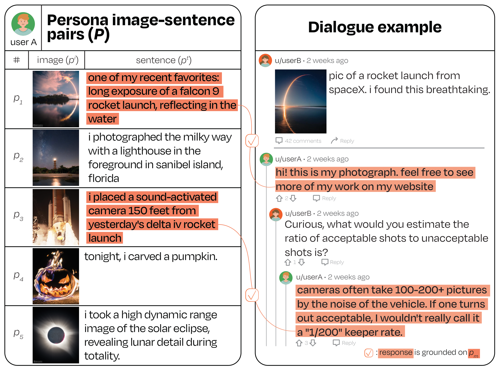

# MPCHAT

Welcome! 👋🏻\
This is the official repository of our ACL 2023 paper: \
**[MPCHAT: Towards Multimodal Persona-Grounded Conversation.](https://arxiv.org/abs/2305.17388)** [[Poster](https://assets.underline.io/lecture/76685/poster_document/9ad3a8c5490d8f2ebba767b5c6efca71.pdf)]



Please cite our work if you found the resources in this repository useful:

```bib
@inproceedings{ahn2023mpchat,
    title={MPCHAT: Towards Multimodal Persona-Grounded Conversation},
    author={Jaewoo Ahn and Yeda Song and Sangdoo Yun and Gunhee Kim},
    booktitle={ACL},
    year=2023
}
```

## Dataset

### Note for dataset users

**Terms of use:** Uses of MPCHAT are subject to [Reddit API terms](https://www.reddit.com/wiki/api-terms/). Users must comply with [Reddit User Agreeement, Content Policy, and Privacy Policy](https://www.redditinc.com/policies).

**Usage restrictions**: MPCHAT should only be used for non-commercial research. Any commercial and for-profit uses of MPCHAT are restricted – it should not be used to train models that will be deployed in production systems as part of a product offered by businesses or government agencies.

Refer to the Ethics Statement in the paper more details.

### Dataset download
You can download our dialog dataset directly by clicking this [link](https://drive.google.com/file/d/18bur87ayw_8NkQsCz_UCml0mHfuytlVu/view?usp=drive_link).

Please check [DATASET.md](DATASET.md) for descriptions of structure and attribute in the dataset.

**Note**: We do not distribute image files as we do not legally own them. The annotation files contain image URLs – you can download images as the following (but it is a bit slow):
```python
python preprocess/download_images.py \
  --dialog_image_url_directory "./dialog_image_urls.json" \
  --persona_image_url_directory "./persona_image_urls.json" \
  --save_dialog_image_directory "/dialog/image/dir/" \
  --save_persona_image_directory "/persona/image/dir/" \
```
or instead, by using the [redcaps-downloader tool](https://github.com/redcaps-dataset/redcaps-downloader).

### Image removal request

Did you find any problematic image in MPCHAT that should be removed? Report it to us using this [link](https://docs.google.com/forms/d/e/1FAIpQLSdz6q2IlE3Npr-ZidJmCAW-xMzu48m5-Jcta4r6FXEHwRBGYQ/viewform?usp=sf_link)! We will review all requests and remove problematic image in the next version release.

## Model training and inference

### Environment setup

We recommend using Anaconda. The following command will create a new conda environment mpchat with all the dependencies.
```bash
conda env create -f environment.yml
```

To activate the environment:
```bash
conda activate mpchat
```

Please check [EXPERIMENT.md](EXPERIMENT.md) for model training and inference per each task.

## Have any questions?

Please contact [Jaewoo Ahn](https://ahnjaewoo.github.io) at jaewoo.ahn at vl.snu.ac.kr

## License

This repository is CC-BY 4.0 licensed. See the [LICENSE](https://github.com/ahnjaewoo/mpchat/blob/main/LICENSE) file for details.
